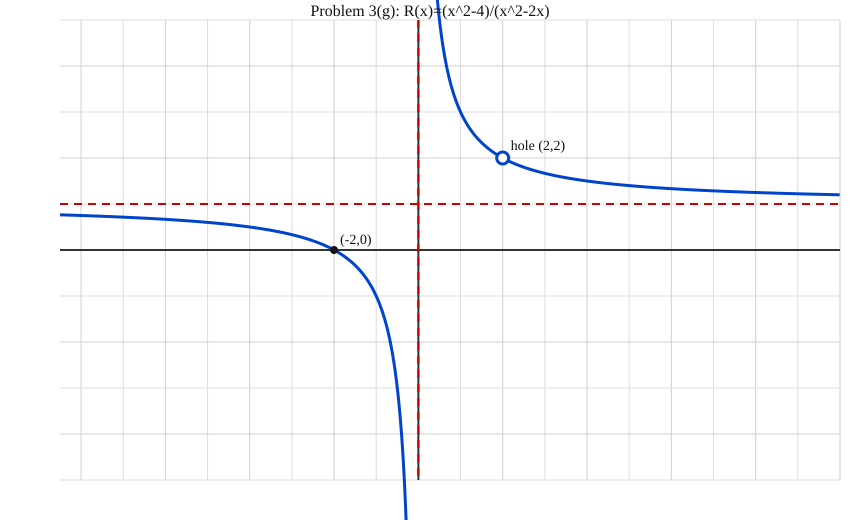
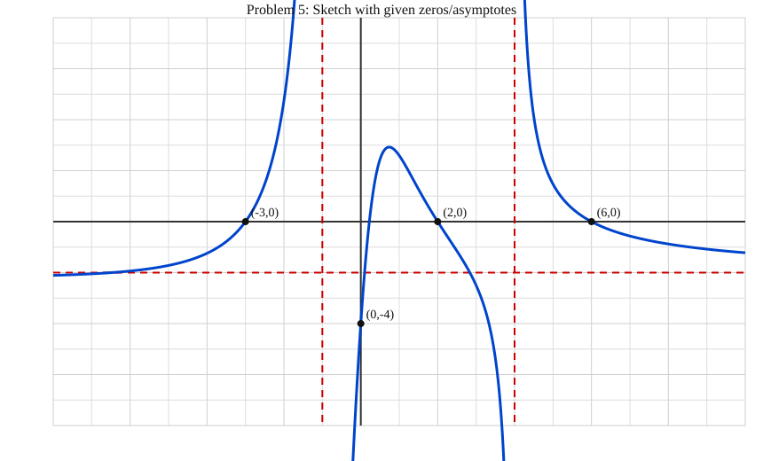

# College Course 141 Pre-Calculus — Solved Set

## Problem 1
Given:
\[
\frac{6x^4-4x^3+9x^2-6}{2x^2-3}
\]

### 1A) Why is long division allowed on this expression?
Long division is allowed because both the numerator and denominator are polynomials, and the denominator is not the zero polynomial. Polynomial long division applies to any polynomial divided by a nonzero polynomial.

### 1B) Perform long division to find the quotient and remainder term.
Divide \(6x^4-4x^3+9x^2+0x-6\) by \(2x^2-3\):

- First term: \(6x^4/(2x^2)=3x^2\)
- Next term: \(-4x^3/(2x^2)=-2x\)
- Next term: \(18x^2/(2x^2)=9\)

So,
\[
\frac{6x^4-4x^3+9x^2-6}{2x^2-3}
=3x^2-2x+9+\frac{-6x+21}{2x^2-3}
\]

- **Quotient:** \(3x^2-2x+9\)
- **Remainder:** \(-6x+21\)

---

## Problem 2
Given:
\[
R(x)=\frac{2x^2-9x+9}{25-x^2}
\]

### 2a) What is the y-intercept?
Set \(x=0\):
\[
R(0)=\frac{9}{25}
\]
So the y-intercept is \(\left(0,\frac{9}{25}\right)\).

### 2b) What are the real zeros?
Factor numerator:
\[
2x^2-9x+9=(2x-3)(x-3)
\]
Set numerator equal to zero:
- \(2x-3=0 \Rightarrow x=\frac{3}{2}\)
- \(x-3=0 \Rightarrow x=3\)

Real zeros: \(x=\frac{3}{2},\;3\).

### 2c) What are the vertical asymptotes?
Set denominator equal to zero:
\[
25-x^2=0\Rightarrow x=\pm 5
\]
No cancellation with the numerator, so vertical asymptotes are:
\[
x=-5,\quad x=5
\]

### 2d) What is the horizontal asymptote?
Degrees are equal (both degree 2). Use ratio of leading coefficients:
- Numerator leading coefficient: \(2\)
- Denominator leading coefficient: \(-1\) (since \(25-x^2=-x^2+25\))

So horizontal asymptote is:
\[
y=-2
\]

---

## Problem 3
Given:
\[
R(x)=\frac{x^2-4}{x^2-2x}
=\frac{(x-2)(x+2)}{x(x-2)}
=\frac{x+2}{x},\quad x\neq 0,2
\]

### 3a) Is there a y-intercept? (why or why not)
No. A y-intercept would require \(x=0\), but \(x=0\) is not in the domain because it makes the denominator zero.

### 3b) For what input value will there be a hole in the graph?
A hole occurs where a factor cancels. The canceled factor is \((x-2)\), so the hole is at:
\[
x=2
\]

### 3c) What is the output value at the hole in the graph?
Use the simplified form \(\frac{x+2}{x}\) and plug in \(x=2\):
\[
y=\frac{2+2}{2}=2
\]
Hole location: \((2,2)\).

### 3d) What is the real zero?
Set simplified numerator equal to zero:
\[
x+2=0\Rightarrow x=-2
\]
Real zero: \(x=-2\) (point \((-2,0)\)).

### 3e) What is the vertical asymptote?
Vertical asymptote comes from non-canceled denominator factor \(x\):
\[
x=0
\]

### 3f) What is the horizontal asymptote?
From simplified form \(\frac{x+2}{x}=1+\frac{2}{x}\), as \(|x|\to\infty\), \(\frac{2}{x}\to 0\), so:
\[
y=1
\]

### 3g) Sketch of the function (with asymptotes, real zero, and hole)

---

## Problem 4
Given:
\[
C(t)=\frac{80t}{t^2+25}
\]
where \(t\) is time in minutes after injection.

### 4a) What is the horizontal asymptote?
The denominator degree (2) is larger than the numerator degree (1), so:
\[
y=0
\]

### 4b) What happens to the concentration of the drug as \(t\) increases?
It starts at 0, rises at first, reaches a highest value, and then gradually decreases back toward 0 as time continues.

### 4c) Draw a graph \(y=C(t)\). Label axes with appropriate unit details. Only need relevant part.
Use only \(t\ge 0\) because negative time is not relevant in this context.

- Horizontal axis: \(t\) (minutes)
- Vertical axis: \(C(t)\) (concentration units)
- Key points for sketching: \((0,0)\), peak at \((5,8)\), then decreasing toward \(y=0\)

### 4d) Based on the graph, when does the maximum concentration happen and what is it?
Differentiate:
\[
C'(t)=\frac{80(25-t^2)}{(t^2+25)^2}
\]
Set \(C'(t)=0\):
\[
25-t^2=0\Rightarrow t=5
\]
(Use \(t=5\) since time is nonnegative.)

Maximum concentration:
\[
C(5)=\frac{80(5)}{25+25}=\frac{400}{50}=8
\]
So the maximum is **8 concentration units at \(t=5\) minutes**.

---

## Problem 5
Required features from the prompt:
- Real zeros at \((-3,0), (2,0), (6,0)\)
- Vertical asymptotes at \(x=-1\) and \(x=4\)
- y-intercept at \((0,-4)\)
- Horizontal asymptote \(y=-2\)

### Sketch
The graph below is labeled with those features.

